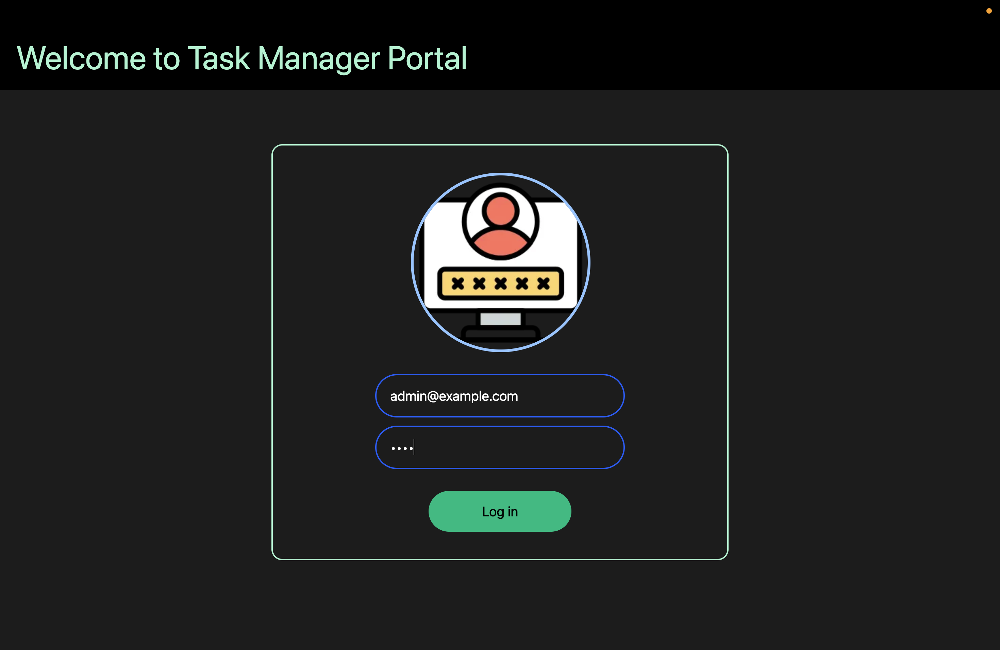
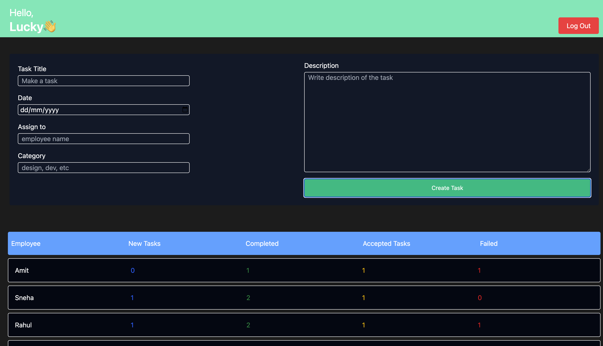
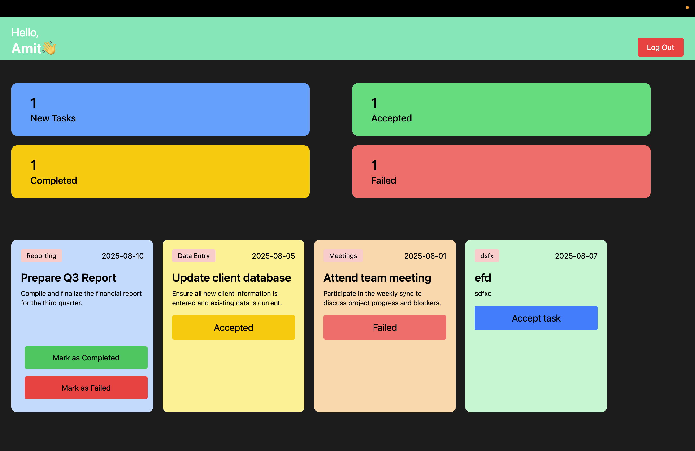

# Employee Task Management Dashboard

A client-side, single-page application (SPA) built with **React** for managing employee tasks. This project simulates a simple admin-employee workflow where admins assign tasks and employees track their progress — all in the browser with **localStorage** as the database.

---

## 🚀 Project Summary

This app serves as a basic Task Management System featuring two roles:

- **Admin** can:
  - View all employees and their task summaries
  - Assign new tasks to employees

- **Employee** can:
  - Log in to view a personalized dashboard
  - See tasks categorized by status (New, Accepted, Completed, Failed)

The project does **not use any backend** — all state and data are stored in the browser using `localStorage`.

---

## 🛠 Core Technologies

| Technology      | Purpose                                      |
|-----------------|----------------------------------------------|
| **React.js**    | Build UI components and SPA logic            |
| **React Context API** | Global state management (no prop drilling) |
| **Tailwind CSS**| Utility-first styling for responsiveness     |
| **localStorage**| Acts as the database for persistent storage  |

---

## 📁 Data Structure

### 👤 Employee Object

```json
{
  "id": 1,
  "firstName": "Amit",
  "email": "employee1@example.com",
  "password": "123",
  "taskCount": {
    "completed": 1,
    "accepted": 1,
    "failed": 1,
    "newtask": 0
  },
  "tasks":  /* Array of task objects */ 
}
```

### ✅ Task Object

```json
{
  "taskTitle": "Prepare Q3 Report",
  "description": "A detailed description of the task.",
  "taskDue": "2025-08-10",
  "completed": false,
  "newtask": true,
  "accepted": false,
  "failed": false,
  "category": "Reporting"
}
```

---

## 🧭 Application Architecture & Data Flow

- **State Management:**  
  Centralized in `AuthProvider.jsx` using `useState` + Context API.  
  This manages both employees and admin login.

- **Authentication & Routing:**  
  Handled in `App.jsx`, which checks credentials and renders either the `AdminDashboard` or `EmployeeDashboard`.

- **Admin Workflow:**  
  - Admin creates tasks.
  - `handleTaskCreate` updates the relevant employee’s task array and `taskCount`.
  - Triggers `updateEmployeesState` which updates both localStorage and React state.

- **Employee Workflow:**  
  - Dashboard is personalized using props.
  - Task data is passed to presentational components (`TaskList`, `TasklistNumber`) for rendering.

---

## 💻 How to Run Locally

```bash
# Clone the repository
git clone https://github.com/Luckyjaglan/EMS.git

# Navigate into the directory
cd EMS

# Install dependencies
npm install

# Start the development server
npm run dev
```

---

## 📌 Features

- 🔐 Role-based login (Admin & Employee)
- 📊 Real-time task stats (New, Accepted, Completed, Failed)
- 📝 Task creation and assignment
- 💾 Persistent storage using localStorage
- 🧱 Fully responsive UI with Tailwind CSS
- 🧠 Smart use of React Context API for global state

---

## ⚠️ Limitations

- ❌ This is a basic project meant for learning purposes.
- 🚧 Some buttons (like **Accept** on employee task cards) are currently **non-functional** or pending implementation.
- 📦 No backend/API connectivity; all data lives in browser storage.

---

## 📷 Screenshots

### 🔐 Login Page


### 🛠 Admin Dashboard


### 👤 Employee Dashboard


---

## ✍️ Future Plans

- Add user signup functionality
- Task filtering and sorting
- Notification system for employees
- Backend integration (e.g., Firebase or Express + MongoDB)
- Mobile-friendly enhancements

---

## 🙋‍♂️ Author

**Lucky Jaglan**  
First React project as part of my learning journey into full-stack development and modern UI architectures.

---

## 📜 License

This project is open-source and free to use.
